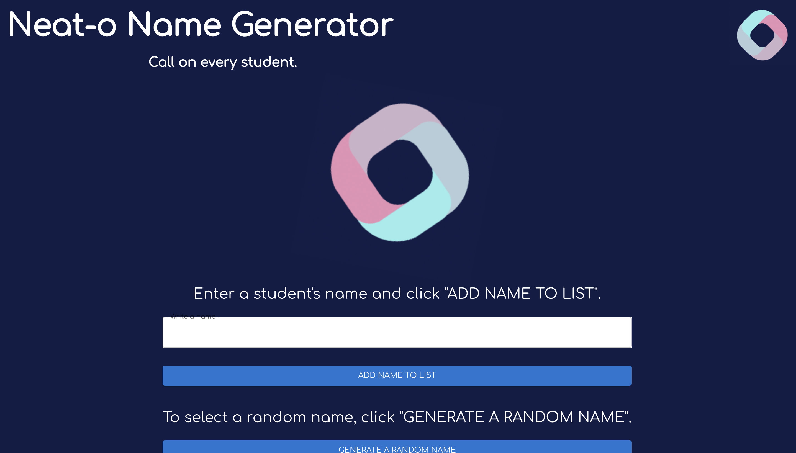
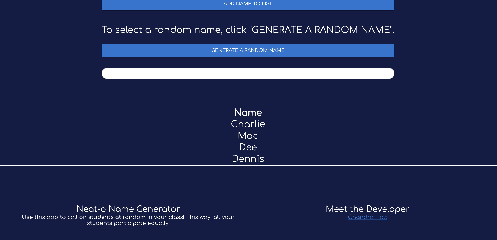

# Neat-O Name Generator

## Description

**NOTE: This project is still in production stages at this time.** This application allows for a teacher to input a list of student names and pull from them at random. This way, all students will participate in class! By calling on students at random, the class will naturally be more engaged and rapt as they wait for their name to be called.

## Table of Contents

1. [Installation](#installation)
2. [Usage](#usage)
3. [Contributing](#contributing)
4. [Tests](#tests)
5. [Screenshots](#screenshots)

## Installation

N/A

## Usage

`AS A teacher, I WANT an app to call on random students to answer questions SO THAT all students end up participating in class.`

## Contributing

Chandra Holt is the sole contributor to this project at this time.

## Tests

**[IN PRODUCTION]**

## Screenshots

### GitHub

[GitHub](https://www.github.com/chandrapanda)

### Email

chandra_holt@hotmail.com

## License

[This application is licensed under Mozilla](https://opensource.org/licenses/MPL-2.0)
